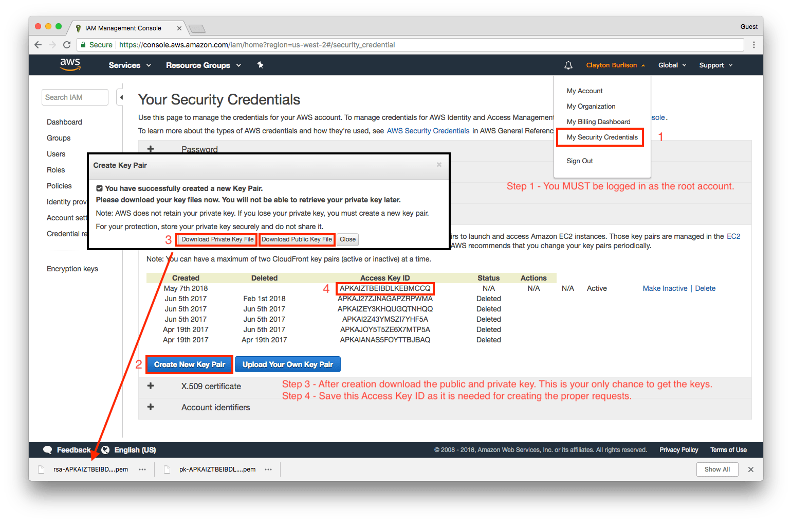

# terraform-munki module

This terraform module creates all the necessary resources in AWS for highly
scalable munki web setup using AWS S3 for object storage and AWS CloudFront
(CDN) for content distribution. You can optionally secure the CDN via signed
URLs so only clients that have your signing certificate can download content.

## Table of Contents

* [**High Level Features**](#high-level-features)
* [**Versions**](#versions)
* [**Terraform Usage**](#terraform-usage)
* [**CloudFront signing key**](#cloudfrount-signing-key)
* [**SNS Alerts**](#sns-alerts)
* [**Lambda Notes**](#lambda-notes)
* [**Inputs**](#inputs)
* [**Outputs**](#outputs)

## NOTE

Currently server side `makecatalogs` via the [s3 Repo Plugin](https://github.com/clburlison/Munki-s3Repo-Plugin) does not function with python3 and munki version 4+. I recommend you keep `server_side_makecatalogs` set to `false`.

## High Level Features

* Restrictions on the S3 bucket to disallow any direct connections
* Use a custom DNS name for the web server or use a supplied URL from AWS
* ~~Rebuild the catalog files whenever a pkginfo file or icon is updated or modified~~ See Note above
* Only pay for what you use
* Optional SNS Alert when a warning or error happen during `makecatalog` run
* Custom TTL values for assets
* Baisc Auth and Cert Based ACL controls

## Versions

At this time, it is impossible to supply your own lambda payload as such you
are stuck on the following versions.

* Munki - [v3.2.1]
* Munki s3Repo Plugin - [0.4.4](https://github.com/clburlison/Munki-s3Repo-Plugin)

## Terraform Usage

```hcl
module "munki-service" {
  source = "git@github.com:clburlison/terraform-munki.git?ref=v1.1.0"
  s3_bucket_name = "megacorp-munki-repo"

  tags = {
    Environment  = "prod"
    BusinessUnit = "ClientABC"
  }
}

For additional instructions please checkout the [examples](./examples) directory.
```

## CloudFront signing key

The CloudFront signing key can not be automatically created. This key can also
only be created by the root account owner, administrator IAM users will not
work.

The creation process can be followed in the following Amazon doc:

[To create CloudFront key pairs]

or via the following graphic:



## SNS Alerts

Terraform is unable to create and validate Simple Notification Service (SNS)
resources so a topic and subscription must be created manually. The following
steps will guide you through an email alert:

1. Log into the AWS Console
1. Go to the Simple Notification Service (SNS) service
1. Create a new topic
1. Click on the created topic ARN to go to the details page
1. Create a subscription
1. Select the protocol and options you want
1. Confirm the subscription (required for the email protocol)
1. Copy the Topic ARN from this page and use in the terraform `alarm_arn` variable

## Lambda Notes

The `lambda_makecatalogs.py` file runs as a AWS Lambda function. It is
triggered from the following s3 events:

* a file under pkginfo/ is modified or uploaded
* a file under icons/ with the extensions of the `.png` or `.jpg` is modified or uploaded

If this setup is destroyed and recreated the 'munki-s3-rw' policy will need to be re-applied to the 'munki_s3' user.

<!-- BEGINNING OF PRE-COMMIT-TERRAFORM DOCS HOOK -->
## Requirements

| Name | Version |
|------|---------|
| <a name="requirement_terraform"></a> [terraform](#requirement\_terraform) | >= 0.12 |

## Providers

| Name | Version |
|------|---------|
| <a name="provider_archive"></a> [archive](#provider\_archive) | 2.2.0 |
| <a name="provider_aws"></a> [aws](#provider\_aws) | 5.0 |

## Modules

No modules.

## Resources

| Name | Type |
|------|------|
| [aws_cloudfront_distribution.munki](https://registry.terraform.io/providers/hashicorp/aws/latest/docs/resources/cloudfront_distribution) | resource |
| [aws_cloudfront_distribution.munki_basic_auth](https://registry.terraform.io/providers/hashicorp/aws/latest/docs/resources/cloudfront_distribution) | resource |
| [aws_cloudfront_origin_access_identity.cf-identity](https://registry.terraform.io/providers/hashicorp/aws/latest/docs/resources/cloudfront_origin_access_identity) | resource |
| [aws_cloudwatch_log_group.munki_makecatalogs](https://registry.terraform.io/providers/hashicorp/aws/latest/docs/resources/cloudwatch_log_group) | resource |
| [aws_cloudwatch_log_metric_filter.errors](https://registry.terraform.io/providers/hashicorp/aws/latest/docs/resources/cloudwatch_log_metric_filter) | resource |
| [aws_cloudwatch_log_metric_filter.warnings](https://registry.terraform.io/providers/hashicorp/aws/latest/docs/resources/cloudwatch_log_metric_filter) | resource |
| [aws_cloudwatch_metric_alarm.Makecatalogs-Error](https://registry.terraform.io/providers/hashicorp/aws/latest/docs/resources/cloudwatch_metric_alarm) | resource |
| [aws_cloudwatch_metric_alarm.Makecatalogs-Warning](https://registry.terraform.io/providers/hashicorp/aws/latest/docs/resources/cloudwatch_metric_alarm) | resource |
| [aws_iam_policy.munki-s3-rw](https://registry.terraform.io/providers/hashicorp/aws/latest/docs/resources/iam_policy) | resource |
| [aws_iam_role.lambda_execution_role](https://registry.terraform.io/providers/hashicorp/aws/latest/docs/resources/iam_role) | resource |
| [aws_iam_role.makecatalogs_lambda](https://registry.terraform.io/providers/hashicorp/aws/latest/docs/resources/iam_role) | resource |
| [aws_iam_role_policy.lambda_execution_role_policy](https://registry.terraform.io/providers/hashicorp/aws/latest/docs/resources/iam_role_policy) | resource |
| [aws_iam_role_policy_attachment.lambda_iam_policy_basic_execution](https://registry.terraform.io/providers/hashicorp/aws/latest/docs/resources/iam_role_policy_attachment) | resource |
| [aws_iam_role_policy_attachment.lambda_munki_s3_rw_policy](https://registry.terraform.io/providers/hashicorp/aws/latest/docs/resources/iam_role_policy_attachment) | resource |
| [aws_lambda_alias.alias](https://registry.terraform.io/providers/hashicorp/aws/latest/docs/resources/lambda_alias) | resource |
| [aws_lambda_function.basic_auth_lambda](https://registry.terraform.io/providers/hashicorp/aws/latest/docs/resources/lambda_function) | resource |
| [aws_lambda_function.lambda](https://registry.terraform.io/providers/hashicorp/aws/latest/docs/resources/lambda_function) | resource |
| [aws_lambda_permission.allow_bucket](https://registry.terraform.io/providers/hashicorp/aws/latest/docs/resources/lambda_permission) | resource |
| [aws_lambda_permission.allow_cloudwatch](https://registry.terraform.io/providers/hashicorp/aws/latest/docs/resources/lambda_permission) | resource |
| [aws_s3_bucket.munki-bucket](https://registry.terraform.io/providers/hashicorp/aws/latest/docs/resources/s3_bucket) | resource |
| [aws_s3_bucket_acl.munki-bucket](https://registry.terraform.io/providers/hashicorp/aws/latest/docs/resources/s3_bucket_acl) | resource |
| [aws_s3_bucket_notification.bucket_notification](https://registry.terraform.io/providers/hashicorp/aws/latest/docs/resources/s3_bucket_notification) | resource |
| [aws_s3_bucket_policy.munki-bucket](https://registry.terraform.io/providers/hashicorp/aws/latest/docs/resources/s3_bucket_policy) | resource |
| [aws_s3_bucket_server_side_encryption_configuration.munki-bucket](https://registry.terraform.io/providers/hashicorp/aws/latest/docs/resources/s3_bucket_server_side_encryption_configuration) | resource |
| [archive_file.basic_auth_payload](https://registry.terraform.io/providers/hashicorp/archive/latest/docs/data-sources/file) | data source |
| [aws_caller_identity.current](https://registry.terraform.io/providers/hashicorp/aws/latest/docs/data-sources/caller_identity) | data source |
| [aws_iam_policy_document.lambda_execution_role_assume_role_policy_document](https://registry.terraform.io/providers/hashicorp/aws/latest/docs/data-sources/iam_policy_document) | data source |
| [aws_iam_policy_document.lambda_execution_role_policy_document](https://registry.terraform.io/providers/hashicorp/aws/latest/docs/data-sources/iam_policy_document) | data source |
| [aws_iam_policy_document.munki_s3_policy](https://registry.terraform.io/providers/hashicorp/aws/latest/docs/data-sources/iam_policy_document) | data source |

## Inputs

| Name | Description | Type | Default | Required |
|------|-------------|------|---------|:--------:|
| <a name="input_alarm_arn"></a> [alarm\_arn](#input\_alarm\_arn) | The arn to send alerts to on lambda errors and warnings | `string` | `""` | no |
| <a name="input_basic_auth_password"></a> [basic\_auth\_password](#input\_basic\_auth\_password) | Password for munki basic auth | `string` | `""` | no |
| <a name="input_basic_auth_user"></a> [basic\_auth\_user](#input\_basic\_auth\_user) | Username for munki basic auth | `string` | `""` | no |
| <a name="input_catalogs_ordered_cache_behavior_default_ttl"></a> [catalogs\_ordered\_cache\_behavior\_default\_ttl](#input\_catalogs\_ordered\_cache\_behavior\_default\_ttl) | The default amount of time (in seconds) that a catalog object is in a CloudFront cache before CloudFront forwards another request in the absence of an Cache-Control max-age or Expires header. | `number` | `30` | no |
| <a name="input_catalogs_ordered_cache_behavior_max_ttl"></a> [catalogs\_ordered\_cache\_behavior\_max\_ttl](#input\_catalogs\_ordered\_cache\_behavior\_max\_ttl) | The maximum amount of time (in seconds) that a catalog object is in a CloudFront cache before CloudFront forwards another request to your origin to determine whether the object has been updated. | `number` | `60` | no |
| <a name="input_catalogs_ordered_cache_behavior_min_ttl"></a> [catalogs\_ordered\_cache\_behavior\_min\_ttl](#input\_catalogs\_ordered\_cache\_behavior\_min\_ttl) | The minimum amount of time (in seconds) that you want catalog objects to stay in CloudFront caches before CloudFront queries your origin to see whether the object has been updated. | `number` | `0` | no |
| <a name="input_cf_default_certificate"></a> [cf\_default\_certificate](#input\_cf\_default\_certificate) | true if you want viewers to use HTTPS to request your objects and you're using the CloudFront domain name for your distribution. Specify this, cf\_acm\_certificate\_arn, or cf\_iam\_certificate\_id | `string` | `"true"` | no |
| <a name="input_cf_dns_aliases"></a> [cf\_dns\_aliases](#input\_cf\_dns\_aliases) | Optionally a list of dns aliases to assign to the CloudFront distribution point | `list(string)` | `[]` | no |
| <a name="input_cf_minimum_protocol_version"></a> [cf\_minimum\_protocol\_version](#input\_cf\_minimum\_protocol\_version) | The minimum version of the SSL protocol that you want CloudFront to use for HTTPS connections. One of SSLv3, TLSv1, TLSv1\_2016, TLSv1.1\_2016 or TLSv1.2\_2018 | `string` | `"TLSv1.2_2018"` | no |
| <a name="input_cf_price_class"></a> [cf\_price\_class](#input\_cf\_price\_class) | The CloudFront pricing tier. One of PriceClass\_All, PriceClass\_200, PriceClass\_100 | `string` | `"PriceClass_All"` | no |
| <a name="input_cf_ssl_cert_arn"></a> [cf\_ssl\_cert\_arn](#input\_cf\_ssl\_cert\_arn) | The ARN of the AWS Certificate Manager certificate to use. Specify this, cf\_cloudfront\_default\_certificate, or cf\_iam\_certificate\_id. The ACM certificate must be in US-EAST-1 | `string` | `""` | no |
| <a name="input_cf_ssl_support_method"></a> [cf\_ssl\_support\_method](#input\_cf\_ssl\_support\_method) | Specifies how you want CloudFront to serve HTTPS requests. Required if you specify acm\_certificate\_arn. One of vip or sni-only. vip is $600 a month don't select that option! | `string` | `""` | no |
| <a name="input_cf_trusted_signers"></a> [cf\_trusted\_signers](#input\_cf\_trusted\_signers) | The AWS accounts, if any, that you want to allow to create signed URLs for private content. Use ['self'] if you want to target the account that owns this CloudFront distribution point | `list(string)` | `[]` | no |
| <a name="input_default_cache_behavior_default_ttl"></a> [default\_cache\_behavior\_default\_ttl](#input\_default\_cache\_behavior\_default\_ttl) | The default amount of time (in seconds) that an object is in a CloudFront cache before CloudFront forwards another request in the absence of an Cache-Control max-age or Expires header. | `number` | `86400` | no |
| <a name="input_default_cache_behavior_max_ttl"></a> [default\_cache\_behavior\_max\_ttl](#input\_default\_cache\_behavior\_max\_ttl) | The maximum amount of time (in seconds) that an object is in a CloudFront cache before CloudFront forwards another request to your origin to determine whether the object has been updated. | `number` | `31536000` | no |
| <a name="input_default_cache_behavior_min_ttl"></a> [default\_cache\_behavior\_min\_ttl](#input\_default\_cache\_behavior\_min\_ttl) | The minimum amount of time (in seconds) that you want objects to stay in CloudFront caches before CloudFront queries your origin to see whether the object has been updated. | `number` | `0` | no |
| <a name="input_enable_icons_basic_auth"></a> [enable\_icons\_basic\_auth](#input\_enable\_icons\_basic\_auth) | When set to 'true' the resource will enable basic auth for icons/ subpath | `bool` | `true` | no |
| <a name="input_icons_ordered_cache_behavior_default_ttl"></a> [icons\_ordered\_cache\_behavior\_default\_ttl](#input\_icons\_ordered\_cache\_behavior\_default\_ttl) | The default amount of time (in seconds) that a icon object is in a CloudFront cache before CloudFront forwards another request in the absence of an Cache-Control max-age or Expires header. | `number` | `30` | no |
| <a name="input_icons_ordered_cache_behavior_max_ttl"></a> [icons\_ordered\_cache\_behavior\_max\_ttl](#input\_icons\_ordered\_cache\_behavior\_max\_ttl) | The maximum amount of time (in seconds) that a icon object is in a CloudFront cache before CloudFront forwards another request to your origin to determine whether the object has been updated. | `number` | `60` | no |
| <a name="input_icons_ordered_cache_behavior_min_ttl"></a> [icons\_ordered\_cache\_behavior\_min\_ttl](#input\_icons\_ordered\_cache\_behavior\_min\_ttl) | The minimum amount of time (in seconds) that you want icon objects to stay in CloudFront caches before CloudFront queries your origin to see whether the object has been updated. | `number` | `0` | no |
| <a name="input_manifests_ordered_cache_behavior_default_ttl"></a> [manifests\_ordered\_cache\_behavior\_default\_ttl](#input\_manifests\_ordered\_cache\_behavior\_default\_ttl) | The default amount of time (in seconds) that a manifest object is in a CloudFront cache before CloudFront forwards another request in the absence of an Cache-Control max-age or Expires header. | `number` | `30` | no |
| <a name="input_manifests_ordered_cache_behavior_max_ttl"></a> [manifests\_ordered\_cache\_behavior\_max\_ttl](#input\_manifests\_ordered\_cache\_behavior\_max\_ttl) | The maximum amount of time (in seconds) that a manifest object is in a CloudFront cache before CloudFront forwards another request to your origin to determine whether the object has been updated. | `number` | `60` | no |
| <a name="input_manifests_ordered_cache_behavior_min_ttl"></a> [manifests\_ordered\_cache\_behavior\_min\_ttl](#input\_manifests\_ordered\_cache\_behavior\_min\_ttl) | The minimum amount of time (in seconds) that you want manifest objects to stay in CloudFront caches before CloudFront queries your origin to see whether the object has been updated. | `number` | `0` | no |
| <a name="input_name"></a> [name](#input\_name) | Name to be used on all resources as the identifier | `string` | `"munki"` | no |
| <a name="input_s3_bucket_create"></a> [s3\_bucket\_create](#input\_s3\_bucket\_create) | Set to true to create a new s3 bucket. If false you can reuse a current bucket | `bool` | `true` | no |
| <a name="input_s3_bucket_name"></a> [s3\_bucket\_name](#input\_s3\_bucket\_name) | The s3 bucket name to use | `any` | n/a | yes |
| <a name="input_s3_encryption_enabled"></a> [s3\_encryption\_enabled](#input\_s3\_encryption\_enabled) | When set to 'true' the resource will have aes256 encryption enabled by default | `bool` | `true` | no |
| <a name="input_server_side_makecatalogs"></a> [server\_side\_makecatalogs](#input\_server\_side\_makecatalogs) | Set to true to enable server side makecatalogs when s3 bucket changes happen | `bool` | `false` | no |
| <a name="input_tags"></a> [tags](#input\_tags) | A map of tags to add to all resources | `map(string)` | `{}` | no |

## Outputs

| Name | Description |
|------|-------------|
| <a name="output_cf_domain_name"></a> [cf\_domain\_name](#output\_cf\_domain\_name) | The cloudfront distribution point domain name |
| <a name="output_cf_hosted_zone_id"></a> [cf\_hosted\_zone\_id](#output\_cf\_hosted\_zone\_id) | The cloudfront distribution point zone id |
<!-- END OF PRE-COMMIT-TERRAFORM DOCS HOOK -->


<!-- html urls -->

[To create CloudFront key pairs]: https://docs.aws.amazon.com/AmazonCloudFront/latest/DeveloperGuide/private-content-trusted-signers.html#private-content-creating-cloudfront-key-pairs
[v3.2.1]: https://github.com/munki/munki/releases/tag/v3.2.1
[CHANGELOG.md]: ./CHANGELOG.md
